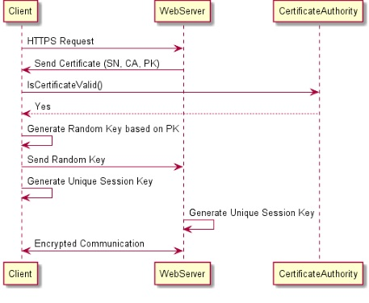
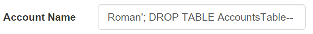
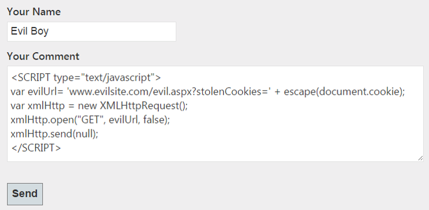
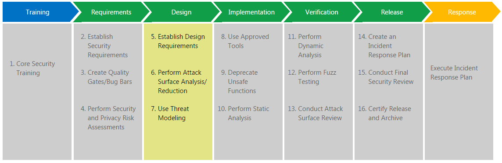
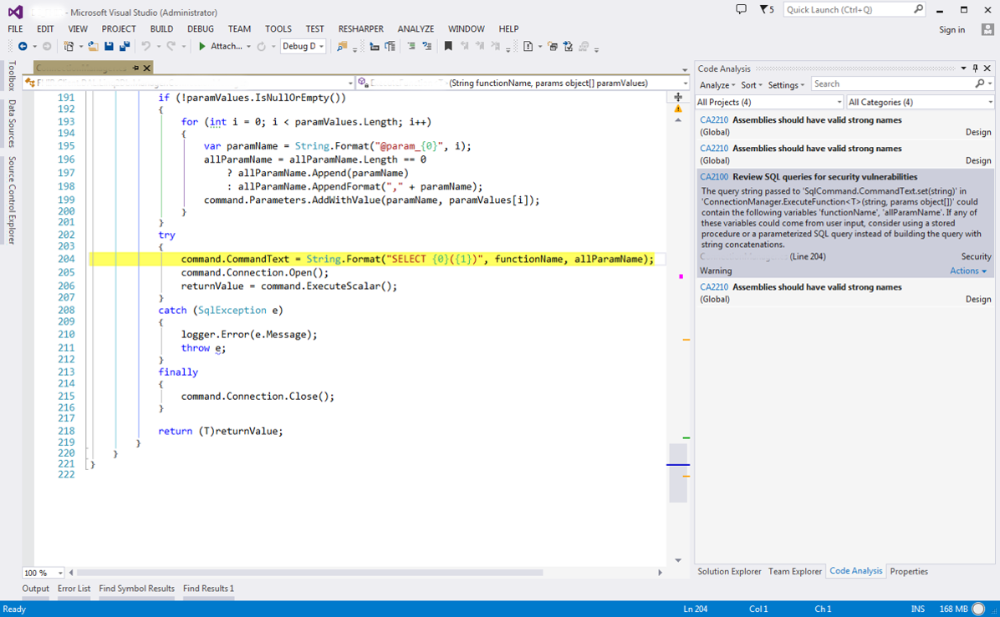

 - title : Security of .NET Application
 - description : Toolset, Common Threats and Prevention Modeling
 - author : Roman Vovk
 - theme : league
 - transition : default

***
#Security of .NET Application
####Lecture 17
###Toolset, Common Threats and Prevention Modeling

***
##Agenda
- Introduction
- Security Overview
- .NET Framework Security
- Typical Security Issues
- Prevention Modeling
- Q&A Session

***

##Security Overview

---
##Security Types
- Types of Security
 - Physical Security (home, office, airport)
 - Political Security (public, national)
 - Economic Security (financial, social)
 - IT Security (information security)
- Information Security
 - Hardware/Software Security
 - Internet/Network Security
 - Application/Data Security

---
##Information Security Threats
- Software attacks
- Identity theft
- Theft of intellectual property
- Theft of equipment
- Information extortion

***

##.NET Framework Security

---
##.NET Security Model Overview
- Code Access Security (CAS)
- Role-Based Security
- Cryptography Model
- Public Key Infrastructure (PKI)
- Authentication/Authorization (Web)

---
##Code Access Security (CAS)
- Imperative Security

<div>

```cs

var fileIOPermission = new FileIOPermission(FileIOPermissionAccess.Read,
                                            "C:\\example\\file.txt");
fileIOPermission.Demand();
```

</div>

- Declarative Security

<div>

```cs
[FileIOPermission(SecurityAction.Demand, Read = "C:\\example\\file.txt")]
private void SomeMethod() { }
```

</div>

---
###CAS Implementations
- DataProtectionPermission
- FileIOPermission
- ReflectionPermission
- RegistryPermission
- SecurityPermission

---
##Role-Based Security
- WindowsIdentity – represents a Windows user

<div>

```cs
var currentIdentity = WindowsIdentity.GetCurrent();
var userName = currentIdentity.Name;
```

</div>

- WindowsPrincipal – enables code to check the Windows group membership of a Windows user

<div>

```cs
var currentPrincipal = (WindowsPrincipal) Thread.CurrentPrincipal;
if (currentPrincipal.IsInRole(WindowsBuiltInRole.Administrator))
{
    // Do something here
}
```

</div>

---
##Cryptography Model
- Symmetric encryption (Aes, DES, RC2, Rijndael, TripleDES)
- Asymmetric encryption (DSA, RSA, ECDiffieHellman, ECDsa)
- DPAPI (ProtectedData.Protect, ProtectedData.Unprotect)

---
###DPAPI Example
<div>

```cs
private static readonly byte[] Entropy = {7, 9, 31, 4, 22};

public static String Encrypt(String original)
{
    var data = Encoding.Unicode.GetBytes(original);
    var encrypted = ProtectedData.Protect(data, Entropy,
                                          DataProtectionScope.LocalMachine);
    return Convert.ToBase64String(ecnrypted);
}

public static String Decrypt(String encrypted)
{
    var data = Convert.FromBase64String(encrypted);
    var decrypted = ProtectedData.Unprotect(data, Entropy,
                                            DataProtectionScope.LocalMachine);
    return Encoding.Unicode.GetString(decrypted);
}
```

</div>

---
##Public Key Infrastructure (PKI)
- Certificate Authority (CA) – sign and revoke digital certificates
 - Symantec, DigiCert, Comodo, etc.
- Server Certificate (SSL/TLS)

<div>



</div>

---
##Authentication/Authorization (Web)
- authentication (None, Forms, <br/> Windows, Passport, OAuth2)

<div>

```xml
<authentication>
  <forms loginUrl="~/Account/Login" timeout="2880" />
</authentication>
```

</div>

- authorization (Users, Roles)

<div>

```xml
<authorization>
  <allow users="Roman" roles="Administrators" verbs="GET, POST" />
  <deny users="*" verbs="DEBUG" />
</authorization>
```

</div>

***

##Typical Security Issues

---
##Security Flaws
- No escaping of input data
- No proper encryption of sensitive data
- Broken authentication and/or session management
- Insecure direct object references
- Security misconfiguration
- Exposure of sensitive data
- No client and/or server validation
- Using components with known vulnerabilities
- Using obsolete unsafe functionality

---
##Security Attacks
- SQL Injections
- XSS Attacks
- Cross-Site Request Forgery (CSRF) Attacks
- Buffer Overflow Attacks
- Canonical Representation Attacks
- Denial of Service (DoS) Attacks
- Trojans (Worms, Viruses, etc.)
- Brute Force Attacks
- Tampering
- Phishing, Social Engineering, etc.

---
##SQL Injection Attack
- Flaws
 - String queries
 - No input validation
 - No authentication or authorization check
- Consequences
 - Confidentiality
 - Authentication/Authorization
 - Data Integrity
- Prevention
 - Parametrized queries and Stored procedures
 - Input validation
 - Access level check

---
##SQL Injection Example
####Case: Remove Table
- Original code of query composition:

<div>

```cs
var query = "SELECT * FROM AccountTable WHERE AccountName = '"
             + GetAccountName() + "'";
```

</div>

- Attacker enters SQL injection script into input control:

<div style="text-align: center;">



</div>

- Assembled malicious query is executed by the Attacker:

<div>

```cs
"SELECT * FROM AccountTable WHERE AccountName = 'Roman';
DROP TABLE AccountTable--'";
```

</div>

---
##XSS Attack
- Flaws
 - No input validation
 - No escaping of special characters
- Consequences
 - Disclosure of session information
 - Execution of malicious scripts
 - Web site defacement
- Prevention
 - Input validation
 - Special characters escaping

---
##XSS Example
####Case: Steal Cookies

<div style="text-align: center;">



</div>

- Attacker enters malicious script into text area control and executes it by clicking on the button

---
##CSRF Attack
- Flaws
 - Sensitive data exposure
 - No proper encryption
- Consequences
 - Authentication
 - Authorization
 - Execution of restricted operations
- Prevention
 - Protection via unique tokens
 - Proper authentication and authorization
 - Re-authentication, Header checking, etc.

---
##CSRF Example
####Case: Transfer Money (GET method)
- URL to transfer money looks like this one: http://bank.com/transfer.aspx?amount=1000&account=userId
- Victim is logged in and have rights to transfer money
- Attacker creates a site with some image:

<div>

```html
<a href="http://bank.com/transfer.aspx?amount=10000&account=EvilBoy">
    
</a>
```

</div>

...

---

<div>
...
</div>

<br/>

- Attacker “invites” Victim to visit his site using Social Engineering techniques (email, call, etc.)
- Victim opens Attacker’s site, clicks on the picture and executes malicious script, which transfers money to Attacker’s account

---
##CSRF Example
####Case: Transfer Money (POST method)
- In case money can be transferred using POST request only, Attacker might use the following code:

<div>

```html
<form action="http://bank.com/transfer.aspx" method="POST">
    <input type="hidden" name="amount" value="100000" />
    <input type="hidden" name="account" value="EvilBoy" />
    <input type="submit" value="View my erotic pictures;)" />
</form>
```

</div>

- Logged Victim clicks on the submit button and sends POST request which transfers money to Attacker’s account

***

##Prevention Modeling

---
##Security Considerations
- Secure Languages
- Trust Relationships
- Logging
- Encryption
- Authentication, Authorization
- Policy, Documentation
- Validation
- Coding, Testing
- The Culture

---
##Security Development Lifecycle
- Code Security Training
- Establishing and Assessment of Security Requirements
- Attack Analysis and Reduction
- Threat Modeling
- Implementation with Emphasis on Security
- Performing of Static Code Analysis
- Performing of Penetration Testing
- Security Review
- Create and Execute Incident Response Plan

---
##Microsoft SDL Model

<div style="text-align: center;">



</div>

---
##Static Code Analysis
- Free Tools
 - FxCop (Code Analyzer in Visual Studio)
 - Code Crawler by OWASP
- Commercial Tools
 - Fortify by HP
 - Security AppScan by IBM

---
##FxCop (Code Analyzer) Example

<div style="text-align: center;">



</div>

***
##Useful Links
- [OWASP: Top 10](https://www.owasp.org/index.php/Top_10_2013-Top_10)
 - [XSS](https://www.owasp.org/index.php/Cross-site_Scripting_(XSS))
 - [SQL Injection](https://www.owasp.org/index.php/SQL_Injection)
 - [CSRF](https://www.owasp.org/index.php/Cross-Site_Request_Forgery_(CSRF))
- [OWASP: How to write insecure code](https://www.owasp.org/index.php/How_to_write_insecure_code)
- [OWASP: NET Security Cheat Sheet](https://www.owasp.org/index.php/.NET_Security_Cheat_Sheet)
- [OWASP: Static Code Analysis Tools](https://www.owasp.org/index.php/Static_Code_Analysis)
- [MSDN: Security in the .NET Framework](https://msdn.microsoft.com/en-us/library/fkytk30f(v=vs.110).aspx)
- [MSDN: Writing Secure Code](https://msdn.microsoft.com/en-us/security/aa570401.aspx)
- [TechNet: Security and Protection](https://technet.microsoft.com/en-us/library/bb510589(v=sql.105).aspx)
- [Security Books](https://msdn.microsoft.com/en-us/security/aa570421.aspx)

***
##Q&A Session

<div style="text-align: center;">


</div>

***
##Thank You!
